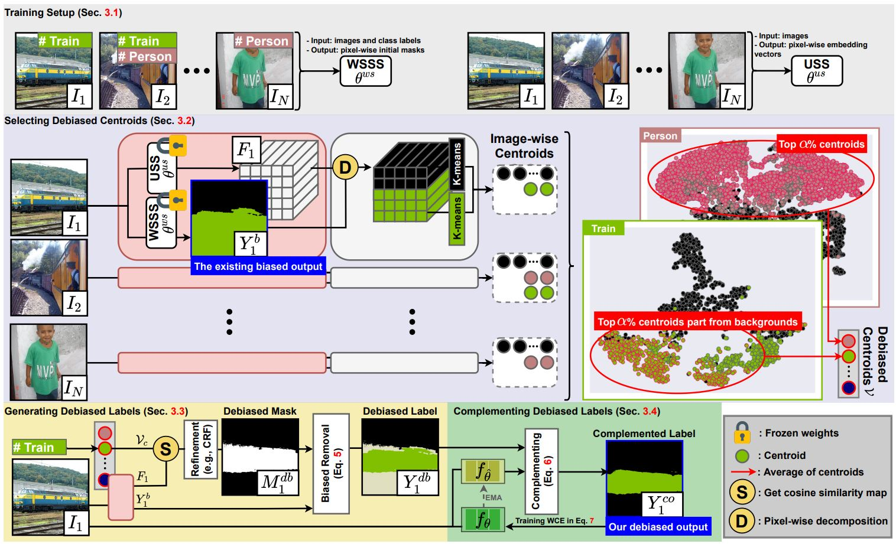

[](https://paperswithcode.com/sota/weakly-supervised-semantic-segmentation-on-4?p=mars-model-agnostic-biased-object-removal)
[](https://paperswithcode.com/sota/weakly-supervised-semantic-segmentation-on-1?p=mars-model-agnostic-biased-object-removal)
[](https://paperswithcode.com/sota/weakly-supervised-semantic-segmentation-on?p=mars-model-agnostic-biased-object-removal)

# MARS: Model-agnostic Biased Object Removal without Additional Supervision for Weakly-Supervised Semantic Segmentation
This repository is the official implementation of "MARS: Model-agnostic Biased Object Removal without Additional Supervision
for Weakly-Supervised Semantic Segmentation". Please feel free to reach out for any questions or discussions.

[[paper]](https://openaccess.thecvf.com/content/ICCV2023/papers/Jo_MARS_Model-agnostic_Biased_Object_Removal_without_Additional_Supervision_for_Weakly-Supervised_ICCV_2023_paper.pdf) [[supp]](https://openaccess.thecvf.com/content/ICCV2023/supplemental/Jo_MARS_Model-agnostic_Biased_ICCV_2023_supplemental.pdf) [[arXiv]](https://arxiv.org/abs/2304.09913)

# Update
[07/14/2023] Our MARS has been accepted to ICCV 2023. 🔥🔥🔥

[04/25/2023] Released initial commits.

### Abstract
Weakly-supervised semantic segmentation aims to reduce labeling costs by training semantic segmentation models using weak supervision, such as image-level class labels. However, most approaches struggle to produce accurate localization maps and suffer from false predictions in class-related backgrounds (\emph{i.e.}, biased objects), such as detecting a railroad with the train class. Recent methods that remove biased objects require additional supervision for manually identifying biased objects for each problematic class and collecting their datasets by reviewing predictions, limiting their applicability to the real-world dataset with multiple labels and complex relationships for biasing. Following the first observation that biased features can be separated and eliminated by matching biased objects with backgrounds in the same dataset, we propose a fully-automatic/model-agnostic biased removal framework called MARS (\textbf{M}odel-\textbf{A}gnostic biased object \textbf{R}emoval without additional \textbf{S}upervision), which utilizes semantically consistent features of an unsupervised technique to eliminate biased objects in pseudo labels. Surprisingly, we show that MARS achieves new state-of-the-art results on two popular benchmarks, PASCAL VOC 2012 (val: 77.7\%, test: 77.2\%) and MS COCO 2014 (val: 49.4\%), by consistently improving the performance of various WSSS models by at least 30\% without additional supervision.



# Citation
- Please cite our paper if the code is helpful to your research.

```
@InProceedings{Jo_2023_ICCV,
    author    = {Jo, Sanghyun and Yu, In-Jae and Kim, Kyungsu},
    title     = {MARS: Model-agnostic Biased Object Removal without Additional Supervision for Weakly-Supervised Semantic Segmentation},
    booktitle = {Proceedings of the IEEE/CVF International Conference on Computer Vision (ICCV)},
    month     = {October},
    year      = {2023},
    pages     = {614-623}
}
```

# Setup
Setting up for this project involves installing dependencies and preparing datasets. The code is tested on Ubuntu 20.04 with NVIDIA GPUs and CUDA installed. 

### Installing dependencies
To install all dependencies, please run the following:
```bash
python3 -m pip install git+https://github.com/lucasb-eyer/pydensecrf.git
python3 -m pip install -r requirements.txt
```

or reproduce our results using docker.
```bash
docker build -t mars_pytorch:v1.8.1 .
docker run \
    --gpus all \
    -it \
    --rm \
    --shm-size 64G \
    --volume="$(pwd):$(pwd)" \
    --workdir="$(pwd)" \
    mars_pytorch:v1.8.1
```

### Preparing datasets

# Preprocessing

### 1. Training USS and WSSS methods
### 2. Generating Debiased Labels

# Training
Our code is coming soon.

# Evaluation
Release our VOC/COCO weights and official results.

| Method | Backbone | Pretrained weight            | VOC val | VOC test | COCO val |
|:-----:|:------------:|:----------------------------:|:-------:|:--------:|:--------:|
| MARS | ResNet-101 | [VOC & COCO]() | 77.7% [link](http://host.robots.ox.ac.uk:8080/anonymous/JWM7SJ.html) | 77.2% [link](http://host.robots.ox.ac.uk:8080/anonymous/XEAPLX.html) | 49.4% |

# Acknowledgment
- This code is heavily borrowed from [RS+EPM](https://github.com/shjo-april/recurseed_and_edgepredictmix).